<div align="center">

<h1>PALoc: Advancing SLAM Benchmarking with Prior-Assisted 6-DoF Trajectory Generation and Uncertainty Estimation</h1>


<a href="https://ieeexplore.ieee.org/document/10480308"></a><a href="https://www.youtube.com/watch?v=_6a2gWYHeUk">
</a>[](https://www.bilibili.com/video/BV11V4y1a7Fd/)<a ></a>[](https://github.com/JokerJohn/PALoc/stargazers)<a href="https://github.com/JokerJohn/PALoc/network/members">

</a> [](https://github.com/JokerJohn/PALoc/issues)[](https://opensource.org/licenses/MIT)

</div>

## Introduction

**PALoc** presents a novel approach for generating high-fidelity, dense 6-DoF ground truth (GT) trajectories, enhancing the evaluation of Simultaneous Localization and Mapping (SLAM) under diverse environmental conditions. This framework leverages prior maps to improve the accuracy of indoor and outdoor SLAM datasets. Key features include:

- **Robustness in Degenerate  Conditions**: Exceptionally handles scenarios frequently encountered in SLAM datasets.
- **Advanced Uncertainty Analysis**: Detailed covariance derivation within factor graphs, enabling precise uncertainty propagation and pose analysis.
- **Open-Source Toolbox**: An [open-source toolbox](https://github.com/JokerJohn/Cloud_Map_Evaluation) is provided for map evaluation, indirectly assessing trajectory precision.
<div align="center">

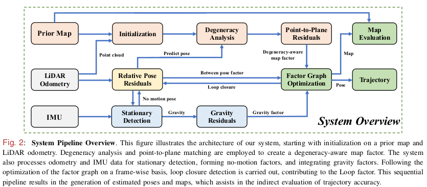
</div>


## News
- **2024/08/15**: Support  newer college dataset!
- **2024/08/15**:  Support FusionPortable dataset and MS-dataset
- **2024/08/14**: 🔥Release codes and data.
- **2024/03/26**: [Early access](https://ieeexplore.ieee.org/document/10480308) by IEEE/ASME TMECH.
- **2024/02/01**: Preparing codes for release.
- **2024/01/29**: Accepted by 2024 IEEE/ASME TMECH.
- **2023/12/08**: Resubmitted.
- **2023/08/22**: Reject and resubmitted.
- **2023/05/13**: Submitted to IEEE/ASME TRANSACTIONS ON MECHATRONICS (TMECH).
- **2023/05/08**: Accepted by [ICRA 2023 Workshop on Future of Construction](https://construction-robots.github.io/#).

## Dataset

### GEODE Dataset

This data was provided by Zhiqiang Chen and [Prof.Yuhua Qi](https://ssse.sysu.edu.cn/teacher/1016) from SYSU.

Stairs  scenes with different  types of lidar and **glass noise**. This is very challenging due to **narrow stairs** ,  you need to tune some parameters of **ICP**. The prior map and raw map can be downloaded.

| [Prior map without glass noise](http://gofile.me/4jm56/SfohLpthw) | [Raw prior map](http://gofile.me/4jm56/pK0A9zTJn) |
| ------------------------------------------------------------ | ------------------------------------------------- |


| Sensor setup           | Download link                    |
| ---------------------- | -------------------------------- |
| Velodyne16+ xsense IMU | http://gofile.me/4jm56/yCBxjdEXA |
| Ouster64 + xsense IMU  | http://gofile.me/4jm56/2EoKPDfKi |

| 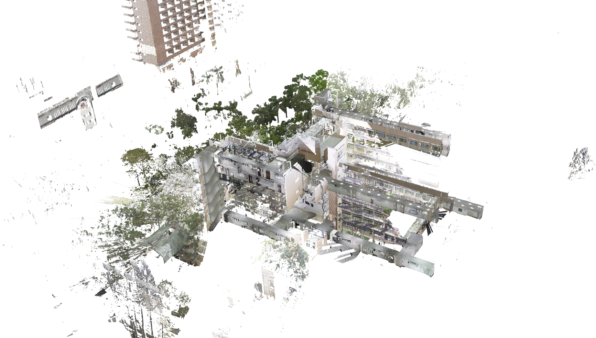 | 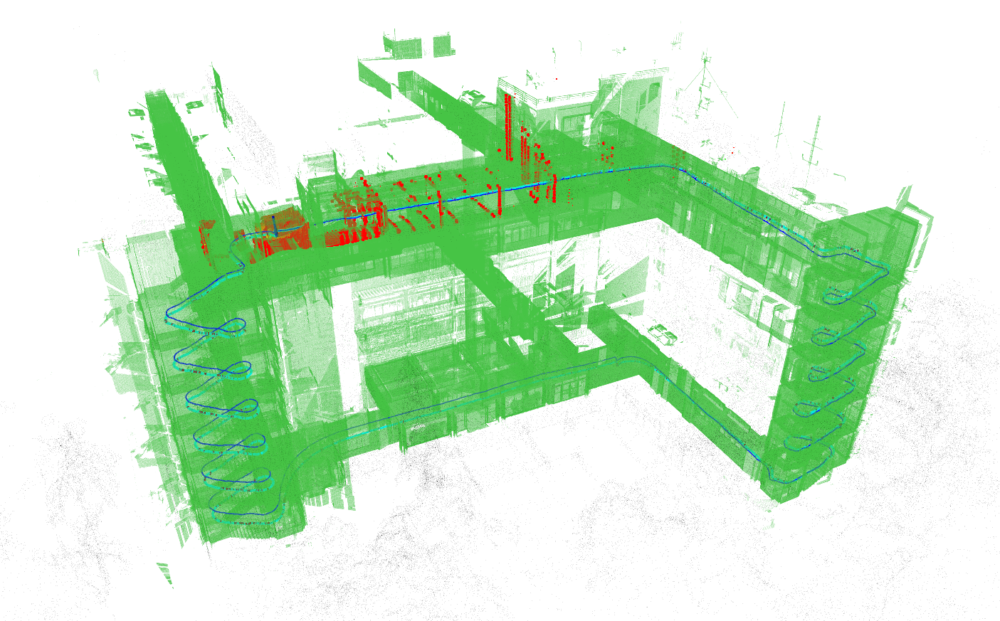 |
| ------------------------------------------------------------ | ------------------------------------------------------------ |


### [FusionPortable Dataset](https://fusionportable.github.io/dataset/fusionportable/)

Our algorithms were rigorously tested on the [Fusion Portable Dataset](https://ram-lab.com/file/site/fusionportable/dataset/fusionportable/). 

| Sequence                                                     | GT Map                                                       | Scene                                              |
| ------------------------------------------------------------ | ------------------------------------------------------------ | -------------------------------------------------- |
| [20220216_corridor_day](https://drive.google.com/drive/folders/1Xc6m3WZrbjdhq9OjfWKDepb9cLKJpety) | [corridor](http://gofile.me/4jm56/mRT2hkB25) with x degeneracy. |  |
| [20220216_canteen_day](https://drive.google.com/drive/folders/1Xc6m3WZrbjdhq9OjfWKDepb9cLKJpety) | [The prior map only covers a portion of the scene.](https://drive.google.com/drive/folders/18b88mLGvx5H84tVBR0ZaaCCKjEY5c8jT) |    |
| [20220219_MCR_normal_01](https://drive.google.com/drive/folders/1SvAanjEgiHufMXybupCKZjbIXhMptoj4) | [Performance on a quadruped robot platform.](https://drive.google.com/drive/folders/18b88mLGvx5H84tVBR0ZaaCCKjEY5c8jT) |        |
| [20220216_escalator_day](https://drive.google.com/drive/folders/1Xc6m3WZrbjdhq9OjfWKDepb9cLKJpety) | [Performance in an open stairwell scenario.](https://drive.google.com/drive/folders/18b88mLGvx5H84tVBR0ZaaCCKjEY5c8jT) |  |
| [20220216_garden_day](https://drive.google.com/drive/folders/1epJURj3r29oOyxkTSEUAHE8__tj9vc1h) | [Smaller scenario, similar to an indoor environment.](https://drive.google.com/drive/folders/18b88mLGvx5H84tVBR0ZaaCCKjEY5c8jT) |      |
| [20220225_building_day](https://drive.google.com/drive/folders/1Xc6m3WZrbjdhq9OjfWKDepb9cLKJpety) | [Three loops of indoor hallway scanning with a handheld device, taking a relatively long time.](https://drive.google.com/drive/folders/18b88mLGvx5H84tVBR0ZaaCCKjEY5c8jT) |  |

### [Newer College Dataset](https://ori-drs.github.io/newer-college-dataset/)

- [Multicam Vision Lidar IMU dataset](https://ori-drs.github.io/newer-college-dataset/multi-cam) : Ouster 128 + Integrated IMU
- [Stereo Vision Lidar IMU dataset](https://ori-drs.github.io/newer-college-dataset/stereo-cam): Ouster 64 + Integrated IMU

This dataset include 2 maps: parkland and math-institute.

| Parkland                                                     | Math-institute                                               |
| ------------------------------------------------------------ | ------------------------------------------------------------ |
| 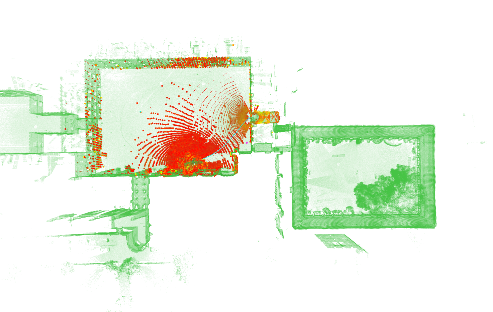 | 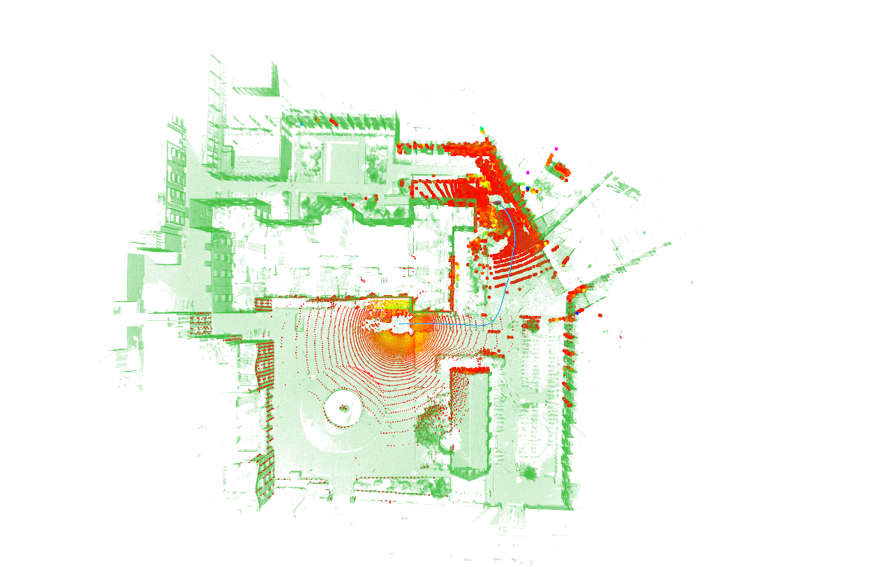 |


### Self-collected Dataset

Below is our sensor kit setup.
<div align="center">

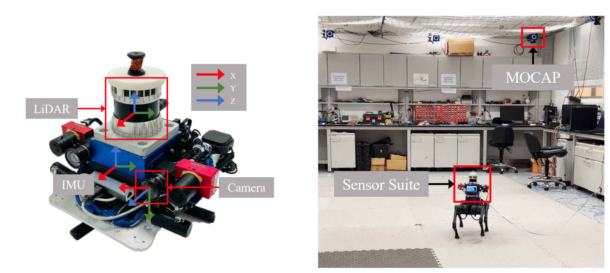

| Sequence                                                     | Scenes                                   | [GT](http://gofile.me/4jm56/C1OOhgG65)                       |
| ------------------------------------------------------------ | ---------------------------------------- | ------------------------------------------------------------ |
| [parkinglot_01](http://gofile.me/4jm56/t9SM1iPZr)            | .png) | [GT](https://hkustconnect-my.sharepoint.com/:t:/g/personal/xhubd_connect_ust_hk/EYoWWAdX8FZBph3LJZ6lck8BuMj43lcEcab9C0fi4Tmqbg?e=GqPs1D) |
| [redbird_02](https://hkustconnect-my.sharepoint.com/:u:/g/personal/xhubd_connect_ust_hk/EXGbd3lDtLNAr6Q_0QPKiH4B1zDYpA2Qr-RTLcKj36KgYw?e=NJ3XxG) |                                          | [GT](https://hkustconnect-my.sharepoint.com/:t:/g/personal/xhubd_connect_ust_hk/EXziPmChz3xGuIwd6_bla0IBbYV5NvCZ92Xff_X17dy9Wg?e=8KoiWr) |

</div>


## Getting Started

### Install

- *[Open3d ( >= 0.11)](https://github.com/isl-org/Open3D)*
- PCL
- [GTSAM 4.0.2](https://github.com/borglab/gtsam/tree/4.0.2)

The GTSAM version should be compatible with running LIO-SAM smoothly. Additionally, **there is no need to install the [livox_ros_driver](https://github.com/Livox-SDK/livox_ros_driver) required by [FAST-LIO](https://github.com/hku-mars/FAST_LIO)2, as we have directly integrated the necessary message headers into the code.**

### Quickly Run

download the demo rosbag and prior map, set the file path in `geode_beta_os64.launch`.

```bash
#ouster64
roslaunch paloc geode_beta_os64.launch

#velodyne16
roslaunch paloc geode_alpha_vlp16.launch

#ouster128 fusionportable-corridor
roslaunch paloc fp_os128_corridor.launch

#pandar xt32
roslaunch paloc ms_sbg_pandar32.launch

#ouster128
roslaunch paloc newer_colleage_os128.launch 
```

then play rosbag:

```bash
# ouster64
rosbag play stairs_bob.bag

#velodyne16
rosbag play stairs_alpha.bag

#ouster128 fusionportable-corridor
rosbag play 20220216_corridor_day_ref.bag

#pandar xt32
rosbag play Parkinglot-2023-10-28-18-59-01.bag 

#ouster128
rosbag play parkland0.bag
```

 You can save data. 

```bash
rosservice call /save_map
```

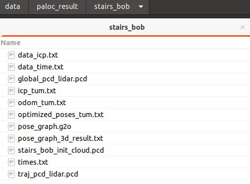

### For your own dataset

#### Set Parameters

Set your file path in `geode_beta_os64.launch`. Put your prior map file in `prior_map_directory`, the map name must be set as the `sequence`.  The map file size is recommend to down-sampled less than 2Gb.  

```bash
<param name="save_directory" type="string" value="/home/xchu/data/paloc_result/"/>
<param name="prior_map_directory" type="string" value="/home/xchu/data/prior_map/paloc_map_file/"/>

<arg name="sequence" default="stairs_bob"/>
```

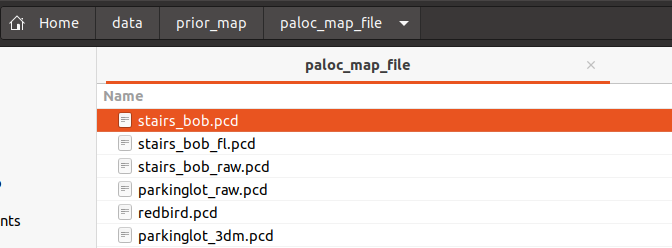

#### Adapt for FAST-LIO2

Set parameters in `geode_beta_os64.yaml`.  Adapt for the FAST-LIO2 first. 

```yaml
common:
  lid_topic: "/ouster/points"
  imu_topic: "/imu/data"

  acc_cov: 1.1118983704388789e-01                     # acc noise and bias
  b_acc_cov: 1.5961182793700285e-03
  gyr_cov: 9.6134865171113148e-02                     # gyro noise and bias
  b_gyr_cov: 7.9993782046705285e-04

  extrinsic_T: [ -0.027172, -0.034873, 0.062643 ]     # from lidar to imu
  extrinsic_R: [ 0.998638, 0.052001, -0.004278,
                 -0.051937, 0.998554, 0.013900,
                 0.004994, -0.013659, 0.999894 ]
lio:
  lidar_type: 8      # 1 for Livox serials LiDAR, 2 for Velodyne LiDAR, 3 for ouster LiDAR,
  scan_line: 64
  scan_rate: 10      # only need to be set for velodyne, unit: Hz,
  timestamp_unit: 3  # 0-second, 1-milisecond, 2-microsecond, 3-nanosecond.
  blind: 0.5         # remove the nearest point cloud

```

#### Initial pose

then set the initial pose.  When you run the launch command, the first point cloud will be saved in `save_directory`,  you can align it with the prior map using [CloudCompare](https://www.danielgm.net/cc/) to get the initial pose.

```yaml
common:
    initial_pose: [ -0.519301, 0.850557, 0.082936 ,-11.347226,
                  -0.852164, -0.522691, 0.024698, 3.002144,
                  0.064357, -0.057849, 0.996249, -0.715776,
                  0.000000, 0.000000, 0.000000, 1.000000 ]
```

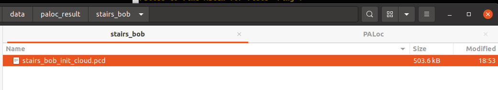

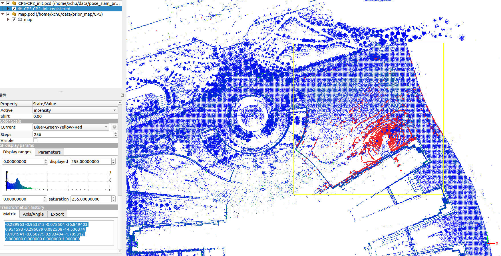

#### Evaluation with [Cloud Map Evaluation Lib](https://github.com/JokerJohn/Cloud_Map_Evaluation)

We can evaluate the map accuracy of PAloc as follows. Note that when you use the Cloud Map Evaluation library, the map of PALoc or ICP  do not need to set initial pose since they are already in the same frame. But evaluate the map from FAST-LIO2 must to set it. 


| Raw Error Map                                                | Entropy Map                                                  |
| ------------------------------------------------------------ | ------------------------------------------------------------ |
| 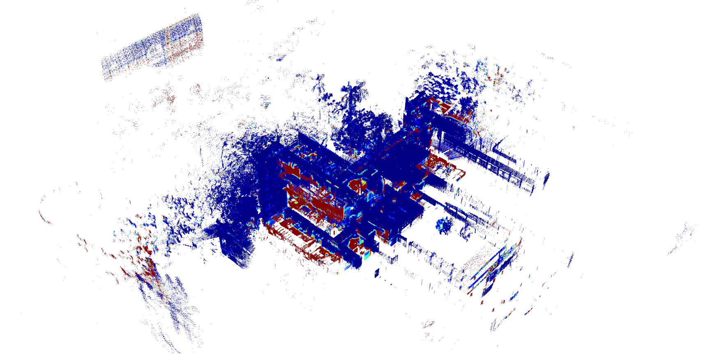 | 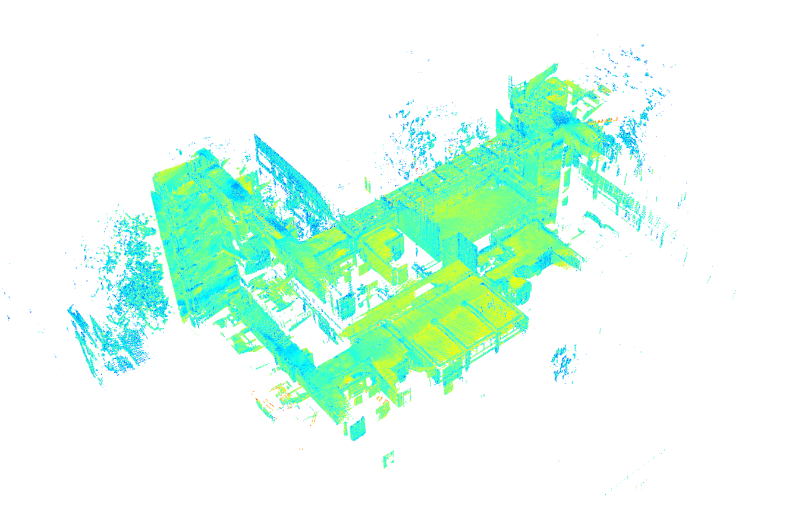 |

Evaluation results example can be [downloaded](http://gofile.me/4jm56/JylhSi89S) here.

 

### TODO

- [ ] clean codes
- [ ] tutorial and parameters tuning
- [ ] support for LIO-SAM
- [ ] gravity factor
- [ ] adapt for more dataset and lidar 


## Results

### Trajectory Evaluation

<div align="center">

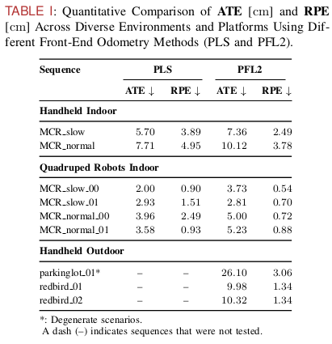
</div>

### Map Evaluation

<div align="center">

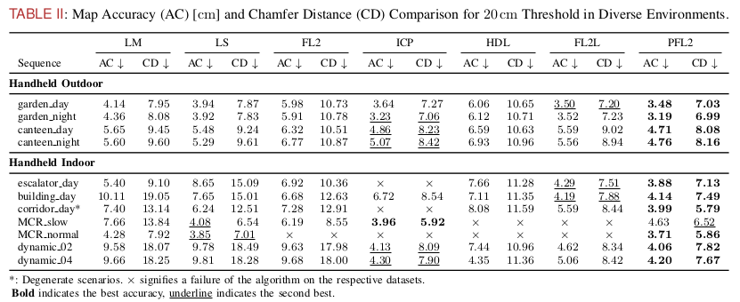
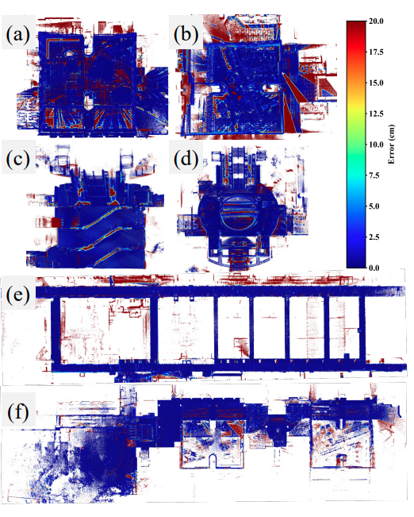
</div>

### Degeneracy Analysis
| X Degenerate (Translation)                                   | Yaw Degenerate (Rotation)                                    |
| ------------------------------------------------------------ | ------------------------------------------------------------ |
| 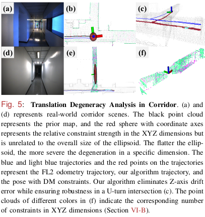 | 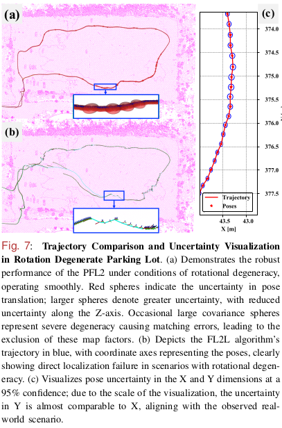 |
<div align="center">

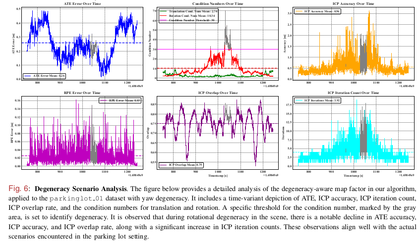
</div>

### Time Analysis

To plot the results, you can follow this [scripts](https://github.com/JokerJohn/SLAMTools/blob/main/Run_Time_analysis/time_analysis.py).

| 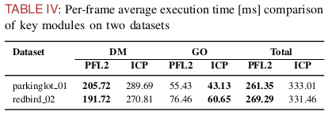 |
| -------------------------------------------------------- |
| 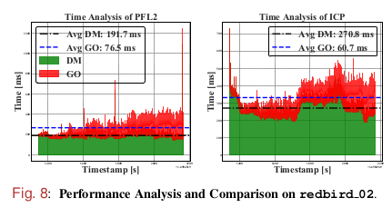 |


## Important Issue

### How do we calculate cov of odom factor in GTSAM?

We follow the assumption of pose Independence as barfoot does(TRO 2014) as equation (13), there is no correlated cov between this two poses. Left-hand convention means a small increments on **world frame**.

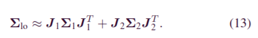

 Since GTSAM follow the right-hand convention on SE(3) , we need to use the adjoint representation as equation (14).  **Please note that there is an error in Equation 14. The paper has not yet been updated. The adjoint matrix of the inverse relative pose should be used, not the adjoint of the relative pose.**

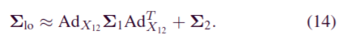

## Citations

For referencing our work in PALoc, please use:
```bibtex
@ARTICLE{hu2024paloc,
  author={Hu, Xiangcheng and Zheng, Linwei and Wu, Jin and Geng, Ruoyu and Yu, Yang and Wei, Hexiang and Tang, Xiaoyu and Wang, Lujia and Jiao, Jianhao and Liu, Ming},
  journal={IEEE/ASME Transactions on Mechatronics}, 
  title={PALoc: Advancing SLAM Benchmarking With Prior-Assisted 6-DoF Trajectory Generation and Uncertainty Estimation}, 
  year={2024},
  volume={},
  number={},
  pages={1-12},
  doi={10.1109/TMECH.2024.3362902}
  }
```
The map evaluation metrics of this work follow [Cloud_Map_Evaluation](https://github.com/JokerJohn/Cloud_Map_Evaluation). Please cite:
```bibtex
@article{jiao2024fp,
  author    = {Jianhao Jiao and Hexiang Wei and Tianshuai Hu and Xiangcheng Hu and Yilong Zhu and Zhijian He and Jin Wu and Jingwen Yu and Xupeng Xie and Huaiyang Huang and Ruoyu Geng and Lujia Wang and Ming Liu},
  title     = {FusionPortable: A Multi-Sensor Campus-Scene Dataset for Evaluation of Localization and Mapping Accuracy on Diverse Platforms},
  booktitle = {2022 IEEE/RSJ International Conference on Intelligent Robots and Systems (IROS)},
  year      = {2022}
}
```

## Acknowledgment

The code in this project is adapted from the following projects:

- The odometry  method is adapted from [FAST-LIO2](https://github.com/hku-mars/FAST_LIO).
- The basic framework for pose graph optimization (PGO) is adapted from [SC-A-LOAM](https://github.com/gisbi-kim/SC-A-LOAM).
- The Point-to-Plane registration is adapted from [LOAM](https://github.com/laboshinl/loam_velodyne).

## Contributors

<a href="https://github.com/JokerJohn/PALoc/graphs/contributors">
  
</a>
