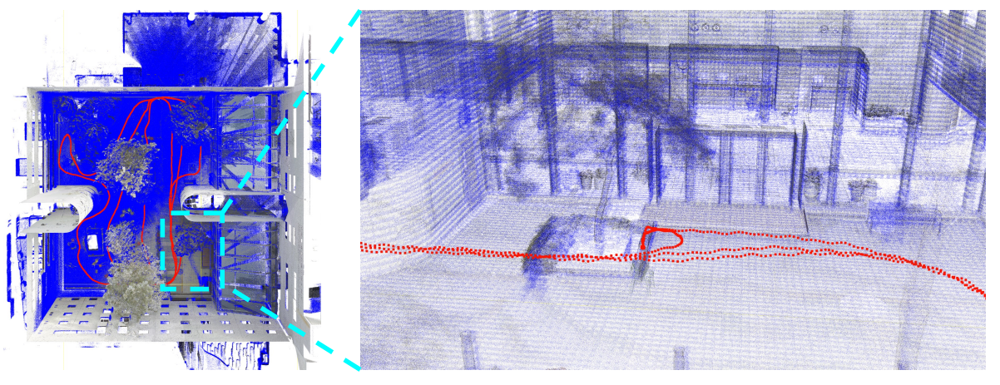

<div id="top" align="center">

# [PALoc: Advancing SLAM Benchmarking with Prior-Assisted 6-DoF Trajectory Generation and Uncertainty Estimation](https://www.researchgate.net/publication/377778512_PALoc_Advancing_SLAM_Benchmarking_with_Prior-Assisted_6-DoF_Trajectory_Generation_and_Uncertainty_Estimation)


</div>

## Table of Contents

- [Introduction](#introduction)
- [News](#news)
- [Dataset](#data)
- [Get Started](#get-started)
- [Results](#Results)
- [Citation](#citation)
- [License](#license)

## Introduction

Accurately generating ground truth (GT) trajectories is essential for Simultaneous Localization and Mapping (SLAM) evaluation, particularly under varying environmental conditions. This study introduces a systematic approach employing a prior map-assisted framework for generating dense six-degree-of-freedom (6-DoF) GT poses for the first time， enhancing the fidelity of both indoor and outdoor SLAM datasets. Our method excels in handling degenerate and stationary conditions frequently encountered in SLAM datasets, thereby increasing robustness and precision. A significant aspect of our approach is the detailed derivation of covariances within the factor graph, enabling an in-depth analysis of pose uncertainty propagation. This analysis crucially contributes to demonstrating specific pose uncertainties and enhancing trajectory reliability from both theoretical and empirical perspectives. Additionally, we provide an [open-source toolbox](https://github.com/JokerJohn/Cloud_Map_Evaluation) for map evaluation criteria, facilitating the indirect assessment of overall trajectory precision.  Experimental results show at least a 30\% improvement in map accuracy and a 20\% increase in direct trajectory accuracy compared to the Iterative Closest Point (ICP)  algorithm across diverse campus environments, with substantially enhanced robustness. Our open-source solution, extensively applied in the FusionPortable  dataset, is geared towards SLAM benchmark dataset augmentation and represents a significant advancement in SLAM evaluations.


## News

- [2024/02.01]
  - Preparing codes.
- [2024/01.29]
  - Accepted by 2024 IEEE/ASME TRANSACTIONS ON MECHATRONICS (TMECH) .
- [2023/12.08]
  - Resubmit.
- [2023/08.22]
  - Reject and resubmit. 
- [2023/05.13]
  - Submitted to  IEEE/ASME TRANSACTIONS ON MECHATRONICS (TMECH) .
- [2023/05.08]
  - Accepted by  **[ICRA 2023 Workshop on Future of Construction](https://construction-robots.github.io/#)**.

## Dataset

Our algorithms were tested on our [FusionPortable](https://ram-lab.com/file/site/fusionportable/dataset/fusionportable/) Dataset. Here is our sensor kit.


## Get Started

Codes will be released after journal accepted.

- [Bilibili](https://www.bilibili.com/video/BV11V4y1a7Fd/)
- [Youtube](https://www.youtube.com/watch?v=_6a2gWYHeUk)

## Results

- Trajectory evaluation


- Map evaluation


- Degeneracy Analysis

| X Degenerate (Translation)                                   | Yaw Degenerate (Rotation)                                    |
| ------------------------------------------------------------ | ------------------------------------------------------------ |
|  |  |


- Time analysis

  


## Citation

For this work,

```
@article{article,
author = {Hu, Xiangcheng and Zheng, Linwei and Wu, Jin and Geng, Ruoyu and Wei, Hexiang and Wang, Lujia and Liu, Ming},
year = {2024},
month = {01},
title = {PALoc: Advancing SLAM Benchmarking with Prior-Assisted 6-DoF Trajectory Generation and Uncertainty Estimation},
journal = {IEEE/ASME Transactions on Mechatronics}
}
```
The map evaluation metrics of this work follows [Cloud_Map_Evaluation](https://github.com/JokerJohn/Cloud_Map_Evaluation). Please cite:
```
@article{,
  author    = {Jianhao Jiao and Hexiang Wei and Tianshuai Hu and Xiangcheng Hu and Yilong Zhu and Zhijian He and Jin Wu and Jingwen Yu and Xupeng Xie and Huaiyang Huang and Ruoyu Geng and Lujia Wang and Ming Liu},
  title     = {FusionPortable: A Multi-Sensor Campus-Scene Dataset for Evaluation of Localization and Mapping Accuracy on Diverse Platforms},
  booktitle = {2022 IEEE/RSJ International Conference on Intelligent Robots and Systems (IROS)},
  year      = {2022}
}
```

## License

All code in this project is released under [GNU General Public License v3.0](./LICENSE).
