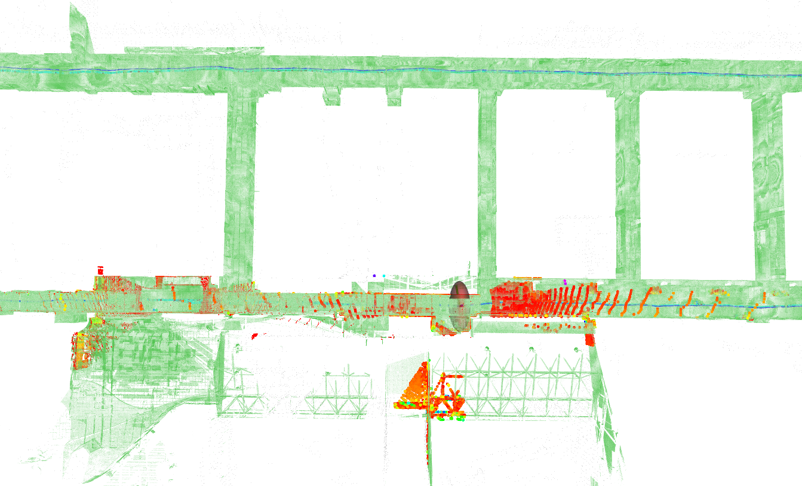
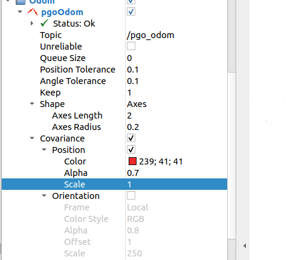
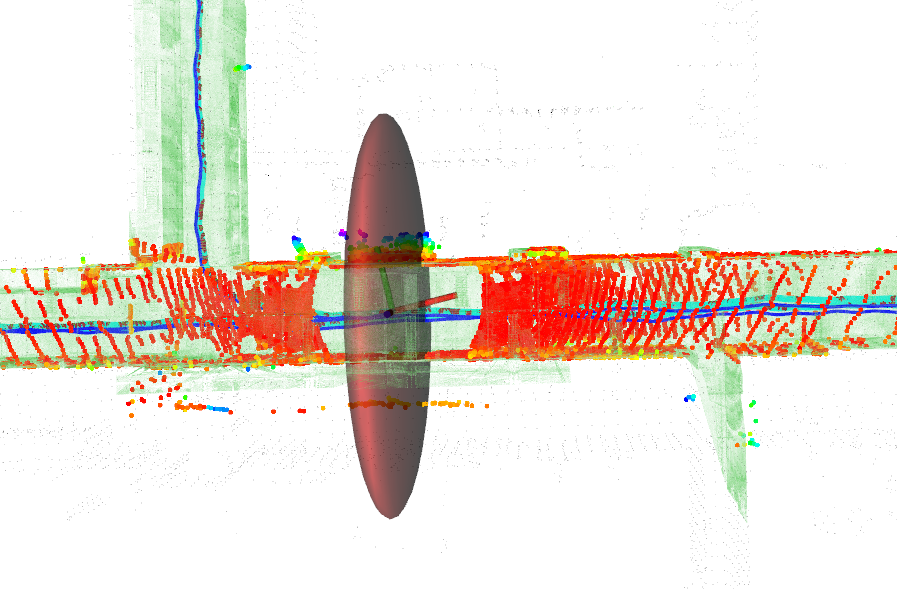

1. ### set two parameters

```yaml
common:
  useLoopClosure: false     
pgo:
  map_filter_size: 0.5                             # the voxe size of the prior map
```

2. ### mode some codes in `InitSystem` function of `paloc.cpp`

```c++
    /** globalmap_filter_ptr is the filterd point cloud of the prior map
     *  if you want to be faster, just use this cloud, but there may need to adjust the icp score to get system initilization success
     * */
     //   std::shared_ptr<geometry::PointCloud> target_o3d =
     //           cloud_process_.GetO3dPointCloudFromPCL(*globalmap_ptr);
std::shared_ptr<geometry::PointCloud> target_o3d cloud_process_.GetO3dPointCloudFromPCL(*globalmap_filter_ptr);
```

3. ### modify the global factor graph to a sliding window approach, but i do not finish it.


## Note:

if you want to see the degeneracy performance, just set the `scale` in  rviz to a proper scale.



set parameter

```yaml
pgo:
  showDegenercy: true                   # show condition number or uncertainty in rviz
```

then you can see the sphere like us. 

